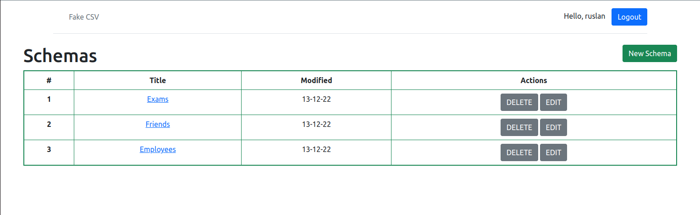
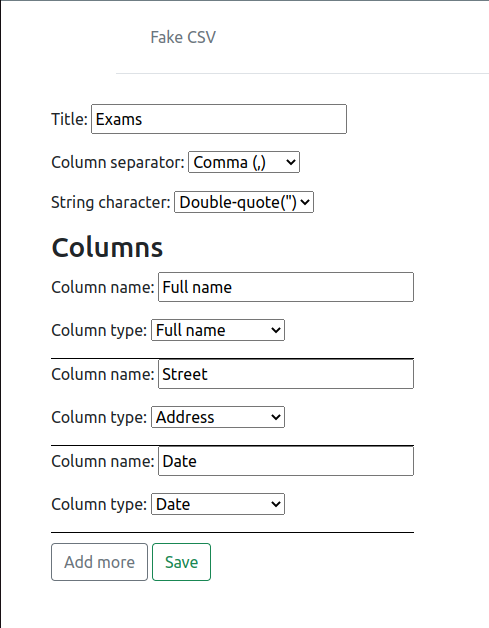
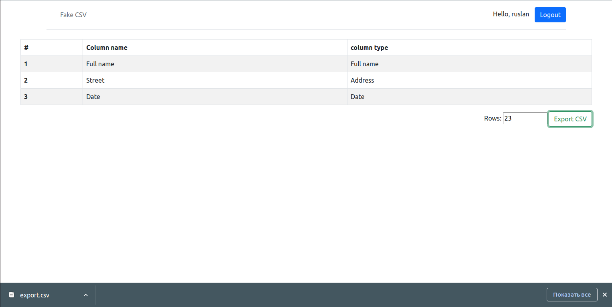

## About The Project
___

"CSV file generate" project was created as an addition for my CV to showcase my professional skills. The site provides
you to generate CVS file with any columns you want and indicate their type.

Also, you can update or delete any of your created schemas.

In create/update form you can write Title, choice column separator
and string character.

When the schema is ready, your next step is to set up the number of rows you 
want to see in your file and press the button "Export CSV". The file will download to your computer automatically.

## What can I do and what features implemented on the site?
___
1. Authorization system using **django.contrib.auth**.
2. Website written strictly on **OPP**.
3. The site uses Django features such as *formsets, Jinja 2, messages framework, CSV module* and so on. 
4. Site was stylized with **Bootstrap 5**, **HTML** and **CSS**.
5. Maintaining the correct project structure, like separation of business logic from models and views into *services.py*. 

### Built With
+ 
+ 
+ 
+ 
+ 
+ 
